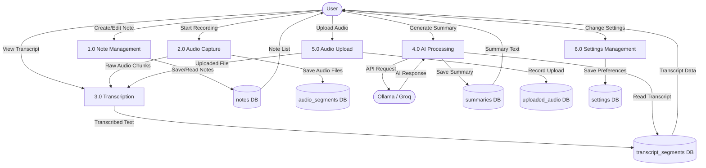
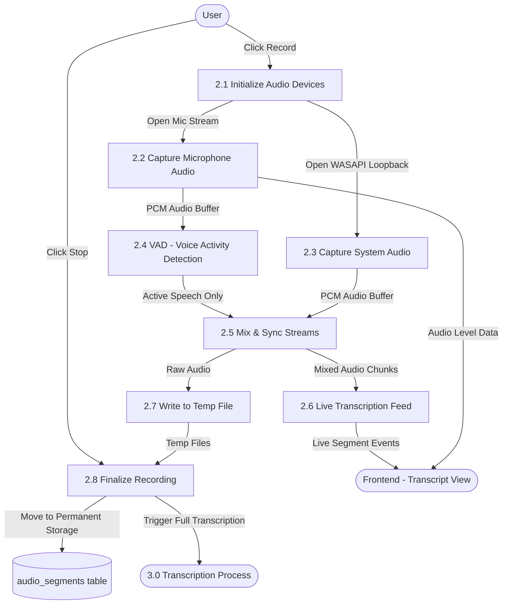
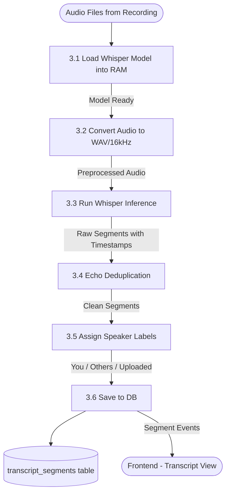
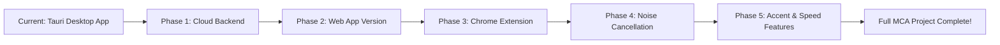

# 📘 note67 — Extended Guide for MCA Study

---

## 1. 🤔 Why This Tech Stack Was Chosen

Understanding the *why* helps you decide if you can change it.

### Rust + Tauri (Backend)

| Why Rust? | Reason |
|-----------|--------|
| **Performance** | Whisper AI model runs C++ under the hood. Rust can call C/C++ directly (via FFI) without overhead — Python cannot do this safely |
| **Memory safety** | Rust prevents crashes and memory bugs — critical for audio processing which deals with raw bytes |
| **System access** | Rust can directly use Windows WASAPI (low-level audio API). Python/Node.js cannot |
| **No runtime** | Rust compiles to a small native binary. No JVM, no Python interpreter needed |

| Why Tauri? | Reason |
|-----------|--------|
| **Desktop app** | Tauri wraps a webview + Rust backend into a `.exe` / `.app` |
| **Lighter than Electron** | Tauri apps are ~10x smaller than Electron apps (no bundled Chromium) |
| **Cross-platform** | Code once, runs on Windows, macOS, Linux |
| **Security** | Tauri has a permission system — the frontend can't do dangerous things without Rust allowing it |

### React + TypeScript (Frontend)

| Why React? | Reason |
|-----------|--------|
| **Component model** | Complex UI (audio player, editor, transcript, AI sidebar) is easier to build as reusable components |
| **Huge ecosystem** | Libraries like Milkdown (editor), react-markdown, etc. all exist for React |
| **Industry standard** | React is used in most modern apps — good to learn |

| Why TypeScript? | Reason |
|-----------|--------|
| **Type safety** | Catches bugs at compile time, not at runtime |
| **Auto-completion** | Your IDE knows what shape the data is — faster coding |

### SQLite (Database)

| Why SQLite? | Reason |
|-----------|--------|
| **No server needed** | Just a single file on disk — perfect for a local desktop app |
| **Zero configuration** | No installation, no port, no password required |
| **Reliable** | Used by Android, iOS, Firefox, Chrome internally |

### Zustand (State Management)

| Why Zustand? | Reason |
|-----------|--------|
| **Simpler than Redux** | About 5x less boilerplate code |
| **Works with React** | Integrates seamlessly with React hooks |

---

## 2. ❓ Can I Change the Stack?

**Short answer: Partially yes, but the core Rust backend is hard to replace.**

### What you CAN replace:

| Current | Alternative | Difficulty |
|---------|------------|------------|
| React → **Svelte or Vue** | Easy — just change the frontend, Tauri doesn't care | Medium |
| Tailwind → **plain CSS or Bootstrap** | Easy | Easy |
| Zustand → **Redux or React Context** | Medium | Medium |
| Milkdown editor → **TipTap or Quill** | Medium | Medium |
| SQLite → **PostgreSQL** | Hard — changes DB connection library | Hard |

### What you CANNOT easily replace:

| Component | Why Not Replaceable |
|-----------|-------------------|
| **Rust backend** | Whisper AI is C++ and only has good Rust/C++ bindings. whisper-rs doesn't have a Python equivalent that works inside Tauri |
| **Tauri** | You could try Electron, but whisper needs Rust anyway |
| **SQLite for local** | If keeping it as a desktop app, SQLite is the right choice |

> **For MCA project:** Don't change the core stack. You'll waste time. Instead, enhance the existing one.

---

## 3. ☁️ Setting Up as a Free Cloud Service (For Low-End PCs)

> **Important:** note67 was designed as a desktop app. To run it in the cloud, you need to **split** it into a web frontend + cloud backend.

### Option A: Hybrid Approach (Recommended for MCA)

Run the **heavy processing in the cloud** (Whisper transcription, Ollama AI), while keeping a lighter app on your PC.

```
Your PC (low-end)                Cloud Server (free tier)
─────────────────                ─────────────────────────
Browser or Electron    ←HTTP→   FastAPI / Flask (Python)
(just the UI)                   ↓
                                Whisper API (transcription)
                                ↓
                                Ollama / Groq AI (summaries)
                                ↓
                                PostgreSQL DB
```

### Free Cloud Platforms

| Platform | What You Get Free | Best For |
|----------|------------------|---------|
| **Railway.app** | $5/month credit, good egress | Full-stack app hosting |
| **Render.com** | 750 hours/month free | Backend API |
| **Hugging Face Spaces** | Free GPU for Whisper! | Transcription API |
| **Groq API** | Free LLM API (llama3, gemma) → replaces Ollama | AI summaries |
| **Supabase** | Free PostgreSQL DB (500MB) | Database |
| **Vercel** | Free frontend hosting | React UI |
| **Cloudflare Pages** | Free static site | React UI |

### Practical Free Architecture

```
┌──────────────────────────────────────────────────────┐
│ FRONTEND → Vercel (Free)                             │
│ React app (your modified note67 frontend)            │
└────────────────────┬─────────────────────────────────┘
                     │ HTTPS API calls
┌────────────────────▼─────────────────────────────────┐
│ BACKEND API → Render.com (Free)                      │
│ Python FastAPI server                                │
│  - Receives audio uploads                            │
│  - Calls Groq API for transcription (free tier)      │
│  - Calls Groq for AI summaries                       │
│  - Stores data in Supabase PostgreSQL                │
└──────────────────────────────────────────────────────┘
```

### Free Transcription: Groq Whisper API

Groq provides a **free API for Whisper** — incredibly fast (better than running locally):

```python
# Python FastAPI backend example
from groq import Groq

client = Groq(api_key="your-free-groq-key")

def transcribe_audio(audio_file):
    transcription = client.audio.transcriptions.create(
        file=audio_file,
        model="whisper-large-v3",
    )
    return transcription.text
```

**Groq Free Limits:** 7,200 seconds of audio/day — enough for a student project.

### Step-by-Step Cloud Migration Plan

1. **Keep the React frontend** — remove Tauri-specific `invoke()` calls, replace with `fetch()` to your API
2. **Write a Python FastAPI backend** that mimics all the Tauri commands
3. **Use Groq API** for Whisper transcription (free, no GPU needed)
4. **Use Groq API** for AI summaries (replaces Ollama)
5. **Deploy frontend to Vercel**, backend to Render.com
6. **Use Supabase** (free PostgreSQL) for the database

---

## 4. 📊 Data Flow Diagrams (DFD)

DFDs show how data moves through the system. There are 3 levels.

---

### DFD Level 0 — Context Diagram (The Big Picture)

Shows the **entire system as one box** with external entities.

```
┌──────────┐         Audio Data          ┌─────────────────────┐
│          │ ─────────────────────────► │                     │
│   USER   │         Commands           │   note67 SYSTEM     │
│          │ ──────────────────────────►│                     │
│          │ ◄─────────────────────────  │                     │
└──────────┘    Notes, Transcripts,     └──────────┬──────────┘
                Summaries, Export                   │
                                                    │ API calls
                                        ┌───────────▼──────────┐
                                        │   OLLAMA / GROQ      │
                                        │   (External AI)      │
                                        └──────────────────────┘
```

**External entities:**
- **User** — Inputs audio, reads text output
- **Ollama / Groq** — External AI service
- **File System** — Where audio files are stored

---

### DFD Level 1 — Major Processes

Breaks the system into its **main functional areas**.



**The 6 major processes are:**

| Process | What it does |
|---------|-------------|
| **1.0 Note Management** | Create, read, update, delete, search notes |
| **2.0 Audio Capture** | Record mic + system audio, pause/resume |
| **3.0 Transcription** | Run Whisper AI to convert audio → text |
| **4.0 AI Processing** | Generate summaries and AI writing suggestions |
| **5.0 Audio Upload** | Handle externally uploaded audio files |
| **6.0 Settings Management** | Store user preferences |

---

### DFD Level 2 — Process 2.0: Audio Capture (Detailed)

This drills deeper into **exactly how audio capture works**.



### DFD Level 2 — Process 3.0: Transcription (Detailed)



### DFD Summary Table

| Level | Name | Shows |
|-------|------|-------|
| **Level 0** | Context Diagram | Entire system as 1 box, external entities only |
| **Level 1** | System Overview | 6 major processes + data stores |
| **Level 2** | Process Detail | Internal steps of each Level 1 process |
| **Level 3** (optional) | Code Level | Individual functions within each step |

> **For your MCA project**, drawing Level 0, Level 1, and Level 2 DFDs is sufficient to demonstrate full system understanding.

---

## 5. 🎙️ Adding New Audio Features

Here's exactly what to study and where to add each feature:

---

### Feature A: Noise Cancellation

**What it means:** Remove background noise (fan, keyboard, traffic) from microphone audio before transcription.

**Technology to use:** [RNNoise](https://github.com/xiph/rnnoise) or [nnnoiseless](https://crates.io/crates/nnnoiseless) (a Rust port).

**Files to study & modify:**

```
src-tauri/src/audio/
  ├── recorder.rs       ← WHERE mic audio comes in; add noise filter HERE
  ├── mixer.rs          ← Where mic + system audio are combined
  └── aec.rs            ← Already has echo cancellation; noise cancellation goes beside this

src-tauri/src/commands/
  └── audio.rs          ← Add toggle command: enable_noise_cancellation(true/false)

src/stores/
  └── whisperStore.ts   ← Add noiseCancel: boolean state

src/components/settings/
  └── (settings file)   ← Add toggle UI in Settings → Audio tab
```

**How to implement (step by step):**

1. Add `nnnoiseless` to [Cargo.toml](file:///c:/Users/naveen/Desktop/note67/src-tauri/Cargo.toml):
   ```toml
   nnnoiseless = "0.5"
   ```

2. In [recorder.rs](file:///c:/Users/naveen/Desktop/note67/src-tauri/src/audio/recorder.rs), after capturing each audio chunk, pass it through the denoiser:
   ```rust
   use nnnoiseless::DenoiseState;
   
   let mut denoiser = DenoiseState::new();
   // For each frame of audio:
   denoiser.process_frame(&mut output_frame, &input_frame);
   ```

3. Add a new command in [audio.rs](file:///c:/Users/naveen/Desktop/note67/src-tauri/src/commands/audio.rs):
   ```rust
   #[tauri::command]
   pub fn set_noise_cancellation(enabled: bool, state: State<AudioState>) {
       state.noise_cancel_enabled.store(enabled, Ordering::Relaxed);
   }
   ```

4. Register the command in [lib.rs](file:///c:/Users/naveen/Desktop/note67/src-tauri/src/lib.rs) (in the `invoke_handler!` list)

5. Add the toggle in the Settings UI

---

### Feature B: Accent Clarification / Normalization

**What it means:** Improve transcription accuracy for non-native English speakers (Indian, Chinese, etc. accents).

**This is NOT really a separate feature — it's about choosing the right Whisper model and settings.**

**Files to study:**

```
src-tauri/src/transcription/
  ├── model.rs          ← Whisper model selection (tiny, base, small, medium, large)
  └── transcriber.rs    ← Whisper inference configuration — add language hints HERE

src-tauri/src/commands/
  └── transcription.rs  ← transcribe_audio command; pass language parameter

src/stores/
  └── whisperStore.ts   ← Add languageHint: string state

src/components/settings/
  └── (whisper settings)← Add language selector dropdown
```

**What to actually implement:**

1. **Use a larger Whisper model** — `whisper-large-v3` has far better accent handling than `base`
2. **Set language explicitly** in transcriber.rs:
   ```rust
   // In transcriber.rs, when calling whisper:
   params.set_language(Some("en")); // Force English, reduce confusion
   ```
3. **Add an "Accent Mode" setting** — in practice this just selects a better model + language setting

4. **Optional:** Use [Groq Whisper](https://groq.com) instead for free accent-aware transcription via the cloud

---

### Feature C: Speaking Speed Adjustment

**Two interpretations:**

#### C1: Adjust playback speed of recorded audio (easier)
This is a **frontend feature only**.

**File to modify:** [src/components/AudioPlayer.tsx](file:///c:/Users/naveen/Desktop/note67/src/components/AudioPlayer.tsx)

```typescript
// AudioPlayer.tsx — Add playback rate control
const audioRef = useRef<HTMLAudioElement>(null);

const setSpeed = (rate: number) => {
  if (audioRef.current) {
    audioRef.current.playbackRate = rate; // 0.5 = slow, 1.0 = normal, 2.0 = fast
  }
};

// Add buttons in the UI:
// [0.5x] [0.75x] [1x] [1.5x] [2x]
```

This requires editing only **one file**: [src/components/AudioPlayer.tsx](file:///c:/Users/naveen/Desktop/note67/src/components/AudioPlayer.tsx)

#### C2: Detect and report speaking speed (advanced)
Calculate words-per-minute from the transcript data.

**File to modify:** [src/components/TranscriptViewer.tsx](file:///c:/Users/naveen/Desktop/note67/src/components/TranscriptViewer.tsx) or new component

```typescript
// Calculate WPM from transcript segments
const calculateWPM = (segments: TranscriptSegment[]) => {
  const totalWords = segments.reduce((sum, seg) => 
    sum + seg.text.split(' ').length, 0);
  const totalMinutes = (segments[segments.length-1].end_time - 
    segments[0].start_time) / 60;
  return Math.round(totalWords / totalMinutes);
};
```

---

### Summary: New Features — Files at a Glance

| Feature | Backend Files | Frontend Files | Difficulty |
|---------|--------------|----------------|------------|
| Noise Cancellation | [audio/recorder.rs](file:///c:/Users/naveen/Desktop/note67/src-tauri/src/audio/recorder.rs), [audio/aec.rs](file:///c:/Users/naveen/Desktop/note67/src-tauri/src/audio/aec.rs), [commands/audio.rs](file:///c:/Users/naveen/Desktop/note67/src-tauri/src/commands/audio.rs), [lib.rs](file:///c:/Users/naveen/Desktop/note67/src-tauri/src/lib.rs) | Settings component, [whisperStore.ts](file:///c:/Users/naveen/Desktop/note67/src/stores/whisperStore.ts) | ⭐⭐⭐ Medium |
| Accent Clarification | [transcription/transcriber.rs](file:///c:/Users/naveen/Desktop/note67/src-tauri/src/transcription/transcriber.rs), [transcription/model.rs](file:///c:/Users/naveen/Desktop/note67/src-tauri/src/transcription/model.rs) | Whisper settings component | ⭐⭐ Easy-Medium |
| Playback Speed | *(none)* | [components/AudioPlayer.tsx](file:///c:/Users/naveen/Desktop/note67/src/components/AudioPlayer.tsx) only | ⭐ Easy |
| Speaking Speed Analytics | [db/mod.rs](file:///c:/Users/naveen/Desktop/note67/src-tauri/src/db/mod.rs) (read segments) | New analytics component | ⭐⭐ Easy-Medium |

---

## 6. 🌐 Converting note67 to a Google Chrome Extension

> **Honest answer:** You **cannot** directly convert note67 into a Chrome Extension. But you CAN build a **Chrome Extension version** that uses the same ideas.

### Why Direct Conversion Is Impossible

| note67 Requirement | Chrome Extension Limitation |
|-------------------|---------------------------|
| Runs Rust/Tauri backend | Extensions only run JavaScript |
| Accesses local filesystem | Extensions have no file system access |
| Runs Whisper AI locally (C++) | No native code execution allowed |
| Records system audio | Extensions can only capture tab audio |
| Reads SQLite database | No native database — only `localStorage` / IndexedDB |

### ✅ What a Chrome Extension CAN Do

A Chrome Extension version would need to be **cloud-backed**:

```
┌────────────────────────────────────────────────────┐
│  CHROME EXTENSION (JS only)                         │
│                                                     │
│  - Content Script: Detect meeting pages            │
│    (meet.google.com, zoom.us, teams.microsoft.com) │
│  - Background Service Worker: Record tab audio     │
│  - Popup UI: Controls, note viewer                 │
│  - Uses Chrome MediaRecorder API for audio         │
└───────────────────┬────────────────────────────────┘
                    │ Upload audio / get transcript
                    │ via HTTPS (fetch API)
┌───────────────────▼────────────────────────────────┐
│  CLOUD BACKEND (Your FastAPI server)               │
│  (Free: Render.com / Railway / Hugging Face)        │
│                                                     │
│  - Receives audio blob from extension              │
│  - Runs Whisper (via Groq free API)                │
│  - Generates summary (via Groq LLM)                │
│  - Stores in cloud DB (Supabase)                   │
└────────────────────────────────────────────────────┘
```

### Chrome Extension Architecture

```
chrome-extension/
├── manifest.json          ← Extension config (permissions, scripts)
├── popup/
│   ├── popup.html         ← Extension popup window (your React UI)
│   ├── popup.tsx          ← React component with note list + controls
│   └── popup.css
├── background/
│   └── service-worker.ts  ← Background task: audio upload, API calls
├── content/
│   └── content-script.ts  ← Injected into meeting pages (auto-detect)
└── icons/
    └── icon.png
```

### Key Chrome APIs You'd Use

| API | Purpose |
|-----|---------|
| `chrome.tabCapture` | Record audio from the current browser tab (Google Meet, etc.) |
| `chrome.storage.local` | Store notes locally in the extension |
| `MediaRecorder` | Record audio to a Blob |
| `fetch()` | Send audio to your cloud backend |
| `chrome.notifications` | Alert user when transcription is done |

### manifest.json (v3) for Recording

```json
{
  "manifest_version": 3,
  "name": "note67 Meeting Notes",
  "version": "1.0",
  "permissions": [
    "tabCapture",
    "storage",
    "activeTab",
    "offscreen"
  ],
  "host_permissions": [
    "https://meet.google.com/*",
    "https://*.zoom.us/*",
    "https://teams.microsoft.com/*"
  ],
  "background": {
    "service_worker": "background/service-worker.js"
  },
  "action": {
    "default_popup": "popup/popup.html",
    "default_icon": "icons/icon.png"
  }
}
```

### Roadmap: Desktop App → Chrome Extension

| Phase | Work | Time |
|-------|------|------|
| **Phase 1** | Build cloud backend (FastAPI + Groq API + Supabase) | 2–3 weeks |
| **Phase 2** | Create extension manifest + basic popup UI | 1 week |
| **Phase 3** | Implement tab audio capture + upload to backend | 1 week |
| **Phase 4** | Show transcription + summary in popup | 1 week |
| **Phase 5** | Meeting auto-detection (Google Meet, Zoom) | 1 week |
| **Phase 6** | Publish to Chrome Web Store ($5 one-time fee) | 1 day |

---

## 7. 🗺️ Complete Feature Roadmap (All Your Ideas Combined)



---

## Quick Reference: Which File for What

| Task | File |
|------|------|
| Change how audio is recorded | [src-tauri/src/audio/recorder.rs](file:///c:/Users/naveen/Desktop/note67/src-tauri/src/audio/recorder.rs) |
| Add noise cancellation | [src-tauri/src/audio/recorder.rs](file:///c:/Users/naveen/Desktop/note67/src-tauri/src/audio/recorder.rs) + [aec.rs](file:///c:/Users/naveen/Desktop/note67/src-tauri/src/audio/aec.rs) |
| Change transcription (Whisper) | [src-tauri/src/transcription/transcriber.rs](file:///c:/Users/naveen/Desktop/note67/src-tauri/src/transcription/transcriber.rs) |
| Add audio playback speed UI | [src/components/AudioPlayer.tsx](file:///c:/Users/naveen/Desktop/note67/src/components/AudioPlayer.tsx) |
| Add a new backend command | `src-tauri/src/commands/` + register in `lib.rs` |
| Add a new database column | `src-tauri/src/db/schema.rs` (add new migration) |
| Change AI prompts | `src-tauri/src/commands/ai.rs` |
| Add new React page/view | `src/App.tsx` or new component in `src/components/` |
| Add global state | `src/stores/` (create new `.ts` Zustand store) |
| Change settings options | `src/components/settings/` + `src-tauri/src/commands/settings.rs` |
